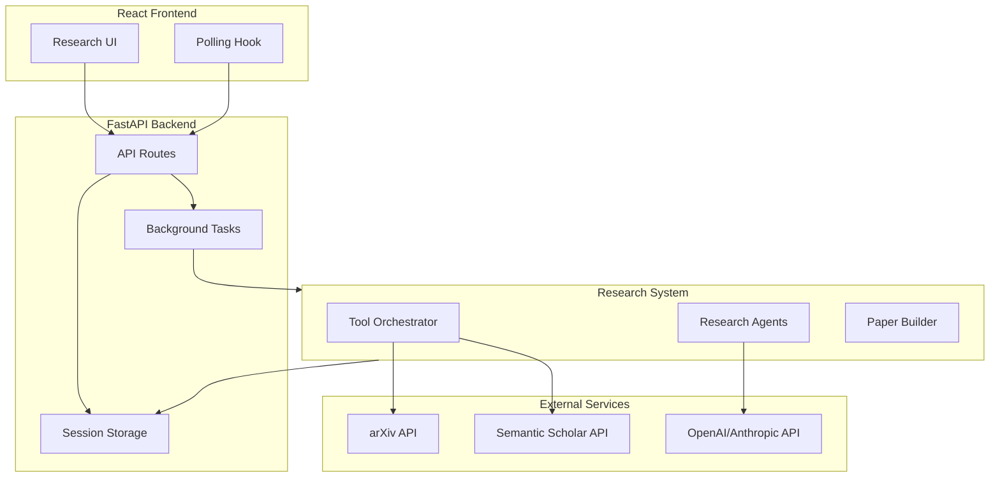

# Design Document: AI Research Agents Implementation

## Overview

This design document outlines the architecture and implementation approach for adding functional AI research agents to the Hybrid AI Research System. The implementation will replace placeholder components with real integrations to academic databases (arXiv, Semantic Scholar), LLM providers (OpenAI/Anthropic), and add background task processing for long-running research operations.

## Architecture



### Data Flow

1. User starts research session via API
2. Backend spawns background task for research pipeline
3. Tool Orchestrator queries external APIs (arXiv, Semantic Scholar)
4. Research Agents use LLM to analyze and generate content
5. Progress updates are written to session storage
6. Frontend polls for updates and displays progress
7. Paper Builder compiles final output when complete

## Components and Interfaces

### 1. Configuration Manager (`src/utils/config.py`)

```python
@dataclass
class APIConfig:
    openai_api_key: Optional[str]
    anthropic_api_key: Optional[str]
    semantic_scholar_api_key: Optional[str]
    llm_provider: str  # "openai" or "anthropic"
    llm_model: str  # e.g., "gpt-4" or "claude-3-sonnet"

class ConfigManager:
    def load_from_env() -> APIConfig
    def validate_config(config: APIConfig) -> List[str]  # Returns warnings
    def get_available_services(config: APIConfig) -> List[str]
```

### 2. Tool Orchestrator (`src/tools/orchestrator.py`)

```python
@dataclass
class Paper:
    title: str
    authors: List[str]
    abstract: str
    publication_date: str
    source_url: str
    doi: Optional[str]
    citation_count: Optional[int]
    source: str  # "arxiv" or "semantic_scholar"

class RateLimiter:
    def __init__(self, requests_per_period: int, period_seconds: float)
    async def acquire(self) -> None
    def get_wait_time(self) -> float

class AutonomousToolOrchestrator:
    def __init__(self, config: APIConfig)
    
    # Literature Search
    async def search_arxiv(self, query: str, max_results: int = 20) -> List[Paper]
    async def search_semantic_scholar(self, query: str, max_results: int = 20) -> List[Paper]
    async def search_all_sources(self, query: str) -> List[Paper]
    
    # Deduplication
    def deduplicate_papers(self, papers: List[Paper]) -> List[Paper]
    
    # Rate Limiting
    def get_api_call_count(self) -> int
    def get_rate_limit_status(self) -> Dict[str, Any]
```

### 3. LLM Client (`src/agents/llm_client.py`)

```python
class LLMClient:
    def __init__(self, config: APIConfig)
    
    async def generate(
        self,
        prompt: str,
        system_prompt: Optional[str] = None,
        max_tokens: int = 2000,
        temperature: float = 0.7
    ) -> str
    
    async def generate_structured(
        self,
        prompt: str,
        response_schema: Dict[str, Any]
    ) -> Dict[str, Any]
```

### 4. Research Agents (`src/agents/swarm.py`)

```python
@dataclass
class AgentResult:
    agent_name: str
    output: Any
    tokens_used: int
    duration_seconds: float

class BaseAgent:
    def __init__(self, llm_client: LLMClient, orchestrator: AutonomousToolOrchestrator)
    async def execute(self, context: Dict[str, Any]) -> AgentResult

class LiteratureAgent(BaseAgent):
    async def search_and_summarize(self, topic: ResearchTopic) -> AgentResult

class GapAnalysisAgent(BaseAgent):
    async def identify_gaps(self, literature_summary: str, topic: ResearchTopic) -> AgentResult

class HypothesisAgent(BaseAgent):
    async def generate_hypotheses(self, gaps: List[str], topic: ResearchTopic) -> AgentResult

class MethodologyAgent(BaseAgent):
    async def design_methodology(self, hypotheses: List[str], topic: ResearchTopic) -> AgentResult

class WritingAgent(BaseAgent):
    async def compose_paper(self, research_context: Dict[str, Any]) -> AgentResult

class AgenticResearchSwarm:
    def __init__(self, config: APIConfig)
    
    async def execute_pipeline(
        self,
        topic: ResearchTopic,
        progress_callback: Callable[[str, int], None]
    ) -> Dict[str, Any]
    
    def get_performance_metrics(self) -> Dict[str, Any]
```

### 5. Background Task Manager (`backend/tasks.py`)

```python
from asyncio import Task
from typing import Callable

class BackgroundTaskManager:
    def __init__(self)
    
    def start_research_task(
        self,
        session_id: str,
        research_system: HybridResearchSystem,
        on_progress: Callable[[str, str, int], None],
        on_complete: Callable[[str, Dict], None],
        on_error: Callable[[str, str], None]
    ) -> Task
    
    def cancel_task(self, session_id: str) -> bool
    def get_running_tasks(self) -> List[str]
```

## Data Models

### Paper Data Structure

```python
@dataclass
class Paper:
    title: str
    authors: List[str]
    abstract: str
    publication_date: str
    source_url: str
    doi: Optional[str] = None
    citation_count: Optional[int] = None
    source: str = "unknown"
```

### Research Stage Output

```python
@dataclass
class StageOutput:
    stage_name: str
    status: str  # "pending", "running", "completed", "failed"
    progress: int  # 0-100
    output: Optional[Dict[str, Any]]
    error: Optional[str]
    started_at: Optional[datetime]
    completed_at: Optional[datetime]
```

### Session State

```python
@dataclass
class SessionState:
    id: str
    status: str  # "configuring", "running", "completed", "failed"
    stages: List[StageOutput]
    metrics: Dict[str, Any]
    paper_content: Optional[Dict[str, Any]]
    error_message: Optional[str]
```

## Correctness Properties

*A property is a characteristic or behavior that should hold true across all valid executions of a system-essentially, a formal statement about what the system should do. Properties serve as the bridge between human-readable specifications and machine-verifiable correctness guarantees.*

### Property 1: Paper normalization completeness
*For any* valid API response from arXiv or Semantic Scholar, the normalized Paper object SHALL contain non-empty values for title, authors, abstract, publication_date, and source_url fields.
**Validates: Requirements 1.3**

### Property 2: Paper deduplication correctness
*For any* list of papers containing duplicates (same DOI or similar titles), deduplication SHALL return a list where no two papers have the same DOI and no two papers have title similarity above 0.9.
**Validates: Requirements 1.5**

### Property 3: Retry behavior on failure
*For any* API request that fails, the system SHALL retry exactly 3 times with exponential backoff (delays of 1s, 2s, 4s) before returning an error.
**Validates: Requirements 1.4**

### Property 4: API key security
*For any* error response, log output, or API response, the content SHALL NOT contain any substring matching configured API key values.
**Validates: Requirements 3.3**

### Property 5: Paper structure completeness
*For any* completed research session, the generated paper SHALL contain all required sections: abstract, introduction, methodology, results, and conclusion.
**Validates: Requirements 2.5**

### Property 6: Stage progress consistency
*For any* research session, stage progress values SHALL be monotonically increasing (never decrease) and status transitions SHALL follow the valid sequence: pending → running → completed|failed.
**Validates: Requirements 4.2, 4.3**

### Property 7: Task completion metrics
*For any* completed agent task, the tasksCompleted metric SHALL increment by exactly 1 and activeAgents SHALL accurately reflect the count of currently executing agents.
**Validates: Requirements 5.3**

### Property 8: Rate limiting enforcement
*For any* sequence of arXiv API calls, the time between consecutive calls SHALL be at least 3 seconds.
**Validates: Requirements 6.1**

### Property 9: Citation completeness
*For any* generated paper that references external works, the BibTeX output SHALL contain an entry for each cited work with valid required fields (author, title, year).
**Validates: Requirements 7.2**

### Property 10: Session failure handling
*For any* background task that throws an exception, the session status SHALL be set to "failed" and error_message SHALL contain a non-empty description.
**Validates: Requirements 4.4**

## Error Handling

### API Error Handling

```python
class APIError(Exception):
    def __init__(self, service: str, status_code: int, message: str)

class RateLimitError(APIError):
    def __init__(self, service: str, retry_after: float)

class AuthenticationError(APIError):
    pass

# Retry decorator with exponential backoff
@retry(max_attempts=3, backoff_base=2, exceptions=(APIError,))
async def api_call_with_retry(func, *args, **kwargs):
    pass
```

### Background Task Error Handling

- Wrap entire pipeline in try/except
- On exception: set session status to "failed", store error message
- Log full stack trace for debugging
- Never expose internal errors to frontend

## Testing Strategy

### Unit Testing

Unit tests will cover:
- Paper normalization from different API response formats
- Deduplication algorithm correctness
- Rate limiter timing behavior
- Configuration loading and validation
- LLM prompt construction

### Property-Based Testing

Property-based tests will use **hypothesis** library for Python to verify:
- Paper normalization completeness (Property 1)
- Deduplication correctness (Property 2)
- API key security (Property 4)
- Stage progress consistency (Property 6)
- Rate limiting enforcement (Property 8)

Each property test will run a minimum of 100 iterations with randomly generated inputs.

Test file naming: `test_*_property.py`

Property test annotation format:
```python
# **Feature: ai-research-agents, Property 1: Paper normalization completeness**
```

### Integration Testing

Integration tests will verify:
- End-to-end research pipeline execution (with mocked external APIs)
- Background task lifecycle management
- Progress update propagation to session storage

### Test Organization

```
backend/
├── tests/
│   ├── test_orchestrator_property.py    # Property tests for tool orchestrator
│   ├── test_agents_property.py          # Property tests for agents
│   ├── test_paper_builder_property.py   # Property tests for paper generation
│   └── test_integration.py              # Integration tests

src/
├── tools/
│   └── orchestrator.py
├── agents/
│   ├── llm_client.py
│   └── swarm.py
└── utils/
    └── config.py
```

