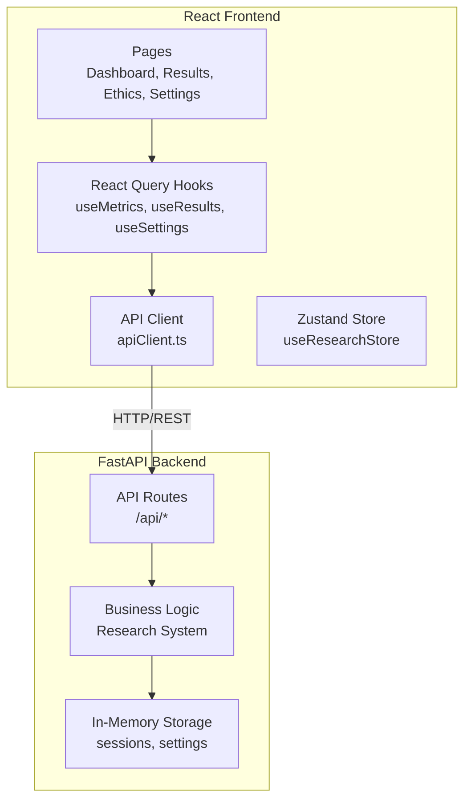

# Design Document: Frontend-Backend Integration

## Overview

This design document outlines the architecture and implementation approach for completing the integration between the React/TypeScript frontend and FastAPI Python backend of the Hybrid AI Research System. The integration will replace static mock data with live backend data, implement real-time updates via polling, add comprehensive error handling, and extend both frontend and backend with missing functionality.

## Architecture

The system follows a client-server architecture with clear separation of concerns:



### Data Flow

1. Pages use React Query hooks to fetch/mutate data
2. Hooks call API client methods
3. API client makes HTTP requests to backend
4. Backend processes requests and returns JSON responses
5. React Query caches responses and triggers UI updates

## Components and Interfaces

### Frontend Components

#### 1. New React Query Hooks (`frontend/src/hooks/`)

```typescript
// useMetrics.ts
interface OverallMetrics {
  totalSessions: number;
  activeSessions: number;
  completedSessions: number;
  avgOriginalityScore: number;
  totalAgents: number;
  activeAgents: number;
}

function useOverallMetrics(): UseQueryResult<OverallMetrics>;
function useSessionMetrics(sessionId: string): UseQueryResult<ResearchMetrics>;

// useResults.ts
interface ResearchResults {
  sessionId: string;
  title: string;
  author: string;
  institution: string;
  originalityScore: number;
  noveltyScore: number;
  ethicsScore: number;
  paper: {
    abstract: string;
    sections: Section[];
    citations: number;
    pages: number;
  };
}

function useCompletedSessions(): UseQueryResult<ResearchSession[]>;
function useSessionResults(sessionId: string): UseQueryResult<ResearchResults>;
function useDownloadPaper(): UseMutationResult<Blob, Error, {sessionId: string, format: 'pdf' | 'latex'}>;

// useCompliance.ts
interface ComplianceReport {
  sessionId: string;
  complianceScore: number;
  categories: ComplianceCategory[];
}

interface ComplianceCategory {
  name: string;
  score: number;
  status: 'passed' | 'failed' | 'warning';
  checks: ComplianceCheck[];
}

function useComplianceReport(sessionId: string): UseQueryResult<ComplianceReport>;
function useAllComplianceReports(): UseQueryResult<ComplianceReport[]>;

// useSettings.ts
interface UserSettings {
  fullName: string;
  email: string;
  institution: string;
  preferences: {
    autoStartEthicsReview: boolean;
    enablePlagiarismDetection: boolean;
    realTimeNotifications: boolean;
  };
}

function useSettings(): UseQueryResult<UserSettings>;
function useUpdateSettings(): UseMutationResult<UserSettings, Error, UserSettings>;
```

#### 2. API Client Extensions (`frontend/src/lib/api.ts`)

```typescript
class ApiClient {
  // Existing methods...
  
  // New methods
  async getOverallMetrics(): Promise<OverallMetrics>;
  async getSettings(): Promise<UserSettings>;
  async updateSettings(settings: UserSettings): Promise<UserSettings>;
  async getAllComplianceReports(): Promise<ComplianceReport[]>;
}
```

#### 3. Error Handling Utility (`frontend/src/lib/errorHandler.ts`)

```typescript
interface ApiError {
  type: 'network' | 'client' | 'server';
  message: string;
  statusCode?: number;
  details?: unknown;
}

function parseApiError(error: unknown): ApiError;
function getErrorMessage(error: ApiError): string;
function getRecoveryAction(error: ApiError): RecoveryAction | null;
```

### Backend Components

#### 1. Settings Endpoints (`backend/main.py`)

```python
class UserSettings(BaseModel):
    fullName: str
    email: str
    institution: str
    preferences: SettingsPreferences

class SettingsPreferences(BaseModel):
    autoStartEthicsReview: bool = True
    enablePlagiarismDetection: bool = True
    realTimeNotifications: bool = True

@app.get("/api/settings")
async def get_settings() -> UserSettings

@app.post("/api/settings")
async def update_settings(settings: UserSettings) -> UserSettings
```

#### 2. Download Endpoint (`backend/main.py`)

```python
from fastapi.responses import FileResponse, Response

@app.get("/api/sessions/{session_id}/download")
async def download_paper(session_id: str, format: str = "pdf") -> Response
```

## Data Models

### Frontend Types (`frontend/src/types/index.ts`)

```typescript
// Existing types remain unchanged

// New types
export interface OverallMetrics {
  totalSessions: number;
  activeSessions: number;
  completedSessions: number;
  avgOriginalityScore: number;
  totalAgents: number;
  activeAgents: number;
}

export interface UserSettings {
  fullName: string;
  email: string;
  institution: string;
  preferences: UserPreferences;
}

export interface UserPreferences {
  autoStartEthicsReview: boolean;
  enablePlagiarismDetection: boolean;
  realTimeNotifications: boolean;
}

export interface ComplianceReport {
  sessionId: string;
  complianceScore: number;
  categories: ComplianceCategory[];
}

export interface ComplianceCategory {
  name: string;
  score: number;
  status: 'passed' | 'failed' | 'warning';
  checks: ComplianceCheck[];
}

export interface ComplianceCheck {
  name: string;
  status: 'passed' | 'failed' | 'warning';
}

export interface ResearchResults {
  sessionId: string;
  title: string;
  author: string;
  institution: string;
  originalityScore: number;
  noveltyScore: number;
  ethicsScore: number;
  paper: PaperDetails;
}

export interface PaperDetails {
  abstract: string;
  sections: PaperSection[];
  citations: number;
  pages: number;
}

export interface PaperSection {
  title: string;
  content: string;
}
```

### Backend Models

The backend already has most required Pydantic models. New additions:

```python
class UserSettings(BaseModel):
    fullName: str
    email: EmailStr
    institution: str
    preferences: SettingsPreferences

class SettingsPreferences(BaseModel):
    autoStartEthicsReview: bool = True
    enablePlagiarismDetection: bool = True
    realTimeNotifications: bool = True
```


## Correctness Properties

*A property is a characteristic or behavior that should hold true across all valid executions of a system-essentially, a formal statement about what the system should do. Properties serve as the bridge between human-readable specifications and machine-verifiable correctness guarantees.*

### Property 1: Metrics API returns valid structure
*For any* call to the metrics endpoint, the response SHALL contain all required fields (totalSessions, activeSessions, completedSessions, avgOriginalityScore, totalAgents, activeAgents) with numeric values.
**Validates: Requirements 1.1**

### Property 2: Sessions API returns valid session objects
*For any* call to the sessions endpoint, each session in the response SHALL contain all required fields (id, config, status, stages, metrics, agents, createdAt, updatedAt) matching the ResearchSession type.
**Validates: Requirements 1.2**

### Property 3: Session filtering by status
*For any* collection of sessions with mixed statuses, filtering by "completed" status SHALL return only sessions where status equals "completed" and no sessions with other statuses.
**Validates: Requirements 2.1**

### Property 4: Error classification consistency
*For any* API error, the error handler SHALL classify it as exactly one of: 'network' (for connection failures), 'client' (for 4xx status codes), or 'server' (for 5xx status codes), and SHALL return an appropriate user-friendly message for each type.
**Validates: Requirements 1.4, 6.1, 6.2, 6.3, 6.4**

### Property 5: Compliance report structure validity
*For any* compliance report returned from the API, it SHALL contain a sessionId, a numeric complianceScore between 0-100, and a non-empty categories array where each category has name, score, status, and checks fields.
**Validates: Requirements 3.1**

### Property 6: Settings round-trip consistency
*For any* valid UserSettings object, posting it to the settings endpoint and then fetching settings SHALL return an equivalent settings object.
**Validates: Requirements 4.1, 4.2, 7.1, 7.2**

### Property 7: Polling termination on terminal status
*For any* research session, the polling mechanism SHALL continue while status is "running" and SHALL stop when status transitions to either "completed" or "failed".
**Validates: Requirements 5.1, 5.3, 5.4**

### Property 8: Invalid settings rejection
*For any* settings object with invalid data (missing required fields, invalid email format, or wrong types), the backend SHALL return a 400 status code with validation error details.
**Validates: Requirements 7.3**

### Property 9: Non-existent session returns 404
*For any* session ID that does not exist in the system, requests to session-specific endpoints SHALL return a 404 status code.
**Validates: Requirements 8.3**

### Property 10: Incomplete session download rejection
*For any* session with status other than "completed", requests to the download endpoint SHALL return a 400 status code indicating the paper is not yet available.
**Validates: Requirements 8.4**

## Error Handling

### Frontend Error Handling Strategy

```typescript
// Error types and handling
type ErrorType = 'network' | 'client' | 'server';

interface ApiError {
  type: ErrorType;
  message: string;
  statusCode?: number;
  retryable: boolean;
}

// Error classification logic
function classifyError(error: unknown): ApiError {
  if (error instanceof TypeError && error.message.includes('fetch')) {
    return { type: 'network', message: 'Unable to connect to server', retryable: true };
  }
  
  if (error instanceof Response) {
    if (error.status >= 400 && error.status < 500) {
      return { type: 'client', message: await extractMessage(error), retryable: false };
    }
    if (error.status >= 500) {
      return { type: 'server', message: 'Server error occurred', retryable: true };
    }
  }
  
  return { type: 'server', message: 'An unexpected error occurred', retryable: false };
}
```

### Backend Error Handling

- Use FastAPI's HTTPException for all error responses
- Return consistent error response format: `{ "detail": "error message" }`
- Log server errors with full stack traces
- Return appropriate HTTP status codes (400, 404, 500)

## Testing Strategy

### Unit Testing

Unit tests will cover:
- API client method behavior (correct URL construction, request formatting)
- Error handler classification logic
- Data transformation utilities
- React Query hook configurations

### Property-Based Testing

Property-based tests will use **fast-check** library for TypeScript to verify:
- API response structure validation
- Error classification consistency
- Settings round-trip persistence
- Session filtering correctness

Each property test will run a minimum of 100 iterations with randomly generated inputs.

Test file naming: `*.property.test.ts`

Property test annotation format:
```typescript
// **Feature: frontend-backend-integration, Property 1: Metrics API returns valid structure**
```

### Integration Testing

Integration tests will verify:
- End-to-end API calls from frontend to backend
- Polling behavior for running sessions
- Download functionality

### Test Organization

```
frontend/src/
├── lib/
│   ├── api.ts
│   ├── api.test.ts           # Unit tests
│   └── api.property.test.ts  # Property tests
├── hooks/
│   ├── useMetrics.ts
│   └── useMetrics.test.ts
└── utils/
    ├── errorHandler.ts
    ├── errorHandler.test.ts
    └── errorHandler.property.test.ts

backend/
├── main.py
└── tests/
    ├── test_settings.py
    ├── test_download.py
    └── test_properties.py    # Property tests using hypothesis
```

Backend property tests will use **hypothesis** library for Python.
